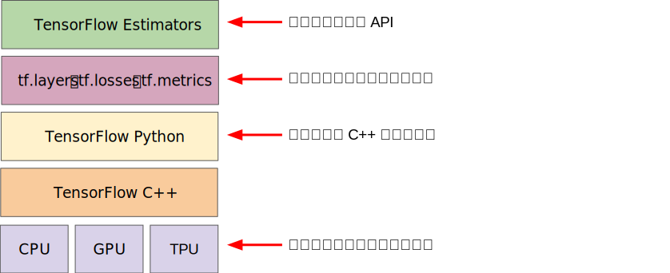

# 使用 TensorFlow 的起始步骤 (First Steps with TensorFlow)：工具包


下图显示了 TensorFlow 工具包的当前层次结构：



**图 1. TensorFlow 工具包层次结构。**

下表总结了不同层的用途：

| 工具包                         | 说明                   |
| ------------------------------ | ---------------------- |
| Estimator (tf.estimator)       | 高级 OOP API。         |
| tf.layers/tf.losses/tf.metrics | 用于常见模型组件的库。 |
| TensorFlow                     | 低级                   |

TensorFlow 由以下两个组件组成：

- [图协议缓冲区](https://www.tensorflow.org/extend/tool_developers/#protocol_buffers)
- 执行（分布式）图的运行时

这两个组件类似于 Java 编译器和 JVM。正如 JVM 会实施在多个硬件平台（CPU 和 GPU）上一样，TensorFlow 也是如此。

您应该使用哪个 API？您应该使用能够解决问题的最高级抽象层。较高级别的抽象层更易于使用，但（设计方面）不够灵活。我们建议您先从最高级 API 入手，让所有组件正常运作起来。如果您希望在某些特殊建模方面能够更加灵活一些，则可以降低一个级别。请注意，每个级别都是使用低级 API 构建的，因此降低层次结构级别应该比较直观。

## tf.estimator API

我们将使用 tf.estimator 来完成机器学习速成课程中的大部分练习。您在练习中所做的一切都可以在较低级别（原始）的 TensorFlow 中完成，但使用 tf.estimator 会大大减少代码行数。

tf.estimator 与 scikit-learn API 兼容。 [scikit-learn](http://scikit-learn.org/) 是极其热门的 Python 开放源代码机器学习库，拥有超过 10 万名用户，其中包括许多 Google 员工。

概括而言，以下是在 tf.estimator 中实现的线性回归程序的格式：

```python
import tensorflow as tf

# Set up a linear classifier.
classifier = tf.estimator.LinearClassifier()

# Train the model on some example data.
classifier.train(input_fn=train_input_fn, steps=2000)

# Use it to predict.
predictions = classifier.predict(input_fn=predict_input_fn)
```


## 编程练习


机器学习速成课程会逐步引导您使用 tf.estimator（一种高级 [TensorFlow](https://www.tensorflow.org/) API）对模型进行编码，以便将学到的原则和技术应用于实践。

机器学习速成课程中的编程练习使用的是可将代码、输出和说明性文字合并到一个协作文档中的数据分析平台。

请按照指定顺序运行以下三个练习：

1. [Pandas 简介](https://colab.research.google.com/notebooks/mlcc/intro_to_pandas.ipynb?utm_source=mlcc&utm_campaign=colab-external&utm_medium=referral&utm_content=pandas-colab&hl=zh-cn)：Pandas 是用于进行数据分析和建模的重要库，广泛应用于 TensorFlow 编码。该教程提供了学习本课程所需的全部 Pandas 信息。如果您已了解 Pandas，则可以跳过此练习。
2. [使用 TensorFlow 的起始步骤](https://colab.research.google.com/notebooks/mlcc/first_steps_with_tensor_flow.ipynb?utm_source=mlcc&utm_campaign=colab-external&utm_medium=referral&utm_content=firststeps-colab&hl=zh-cn)：此练习介绍了线性回归。
3. [合成特征和离群值](https://colab.research.google.com/notebooks/mlcc/synthetic_features_and_outliers.ipynb?utm_source=mlcc&utm_campaign=colab-external&utm_medium=referral&utm_content=syntheticfeatures-colab&hl=zh-cn)：此练习介绍了合成特征以及输入离群值带来的影响。
