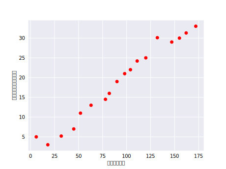
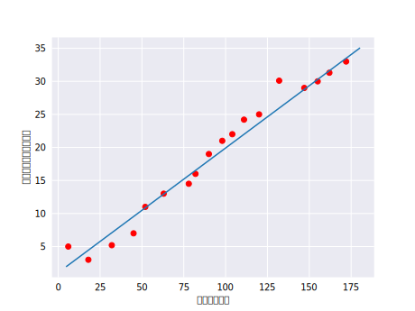

# 线性回归

人们早就知晓，相比凉爽的天气，蟋蟀在较为炎热的天气里鸣叫更为频繁。数十年来，专业和业余昆虫学者已将每分钟的鸣叫声和温度方面的数据编入目录。Ruth 阿姨将她喜爱的蟋蟀数据库作为生日礼物送给您，并邀请您自己利用该数据库训练一个模型，从而预测鸣叫声与温度的关系。

首先建议您将数据绘制成图表，了解下数据的分布情况：

毫无疑问，此曲线图表明温度随着鸣叫声次数的增加而上升。鸣叫声与温度之间的关系是线性关系吗？是的，您可以绘制一条直线来近似地表示这种关系，如下所示：

事实上，虽然该直线并未精确无误地经过每个点，但针对我们拥有的数据，清楚地显示了鸣叫声与温度之间的关系。只需运用一点代数知识，您就可以将这种关系写下来，如下所示：

<math xmlns="http://www.w3.org/1998/Math/MathML" display="block">
  <mi>y</mi>
  <mo>=</mo>
  <mi>m</mi>
  <mi>x</mi>
  <mo>+</mo>
  <mi>b</mi>
</math>

其中：

 * 指的是温度（以摄氏度表示），即我们试图预测的值。
 * 指的是直线的斜率。
 * 指的是每分钟的鸣叫声次数，即输入特征的值。
 * 指的是 y 轴截距。

按照机器学习的惯例，您需要写一个存在细微差别的模型方程式：

<math xmlns="http://www.w3.org/1998/Math/MathML" display="block">
  <msup>
​    <mi>y</mi>
​    <mo>&#x2032;</mo>
  </msup>
  <mo>=</mo>
  <mi>b</mi>
  <mo>+</mo>
  <msub>
​    <mi>w</mi>
​    <mn>1</mn>
  </msub>
  <msub>
​    <mi>x</mi>
​    <mn>1</mn>
  </msub>
</math>

其中：

-  <math xmlns="http://www.w3.org/1998/Math/MathML">
    <msup>
  ​    <mi>y</mi>
  ​    <mo>&#x2032;</mo>
    </msup>
  </math>指的是预测[标签](https://developers.google.com/machine-learning/crash-course/framing/ml-terminology#labels)（理想输出值）。
-  b 指的是偏差（y 轴截距）。而在一些机器学习文档中，它称为 。
-  <math xmlns="http://www.w3.org/1998/Math/MathML">
    <msub>
  ​    <mi>w</mi>
  ​    <mn>1</mn>
    </msub>
  </math>指的是特征 1 的权重。权重与上文中用  表示的“斜率”的概念相同。
- <math xmlns="http://www.w3.org/1998/Math/MathML">
    <msub>
  ​    <mi>x</mi>
  ​    <mn>1</mn>
    </msub>
  </math>指的是[特征](https://developers.google.com/machine-learning/crash-course/framing/ml-terminology#features)（已知输入项）。

要根据新的每分钟的鸣叫声值  <math xmlns="http://www.w3.org/1998/Math/MathML">
  <msub>
​    <mi>x</mi>
​    <mn>1</mn>
  </msub>
</math> **推断**（预测）温度<math xmlns="http://www.w3.org/1998/Math/MathML">
  <msup>
​    <mi>y</mi>
​    <mo>&#x2032;</mo>
  </msup>
</math> ，只需将 <math xmlns="http://www.w3.org/1998/Math/MathML">
  <msub>
​    <mi>x</mi>
​    <mn>1</mn>
  </msub>
</math> 值代入此模型即可。

下标<math xmlns="http://www.w3.org/1998/Math/MathML">
  <msub>
​    <mi>w</mi>
​    <mn>1</mn>
  </msub>
</math>（例如  和<math xmlns="http://www.w3.org/1998/Math/MathML">
  <msub>
​    <mi>x</mi>
​    <mn>1</mn>
  </msub>
</math> ）预示着可以用多个特征来表示更复杂的模型。例如，具有三个特征的模型可以采用以下方程式：

<math xmlns="http://www.w3.org/1998/Math/MathML" display="block">
  <msup>
​    <mi>y</mi>
​    <mo>&#x2032;</mo>
  </msup>
  <mo>=</mo>
  <mi>b</mi>
  <mo>+</mo>
  <msub>
​    <mi>w</mi>
​    <mn>1</mn>
  </msub>
  <msub>
​    <mi>x</mi>
​    <mn>1</mn>
  </msub>
  <mo>+</mo>
  <msub>
​    <mi>w</mi>
​    <mn>2</mn>
  </msub>
  <msub>
​    <mi>x</mi>
​    <mn>2</mn>
  </msub>
  <mo>+</mo>
  <msub>
​    <mi>w</mi>
​    <mn>3</mn>
  </msub>
  <msub>
​    <mi>x</mi>
​    <mn>3</mn>
  </msub>
</math>

