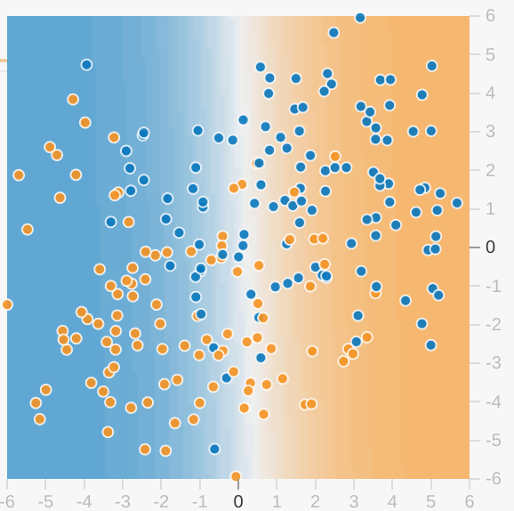

# Playground 练习

## 学习速率和收敛

这是一系列 Playground 练习中的第一个练习。 [Playground](http://playground.tensorflow.org/) 是专为本课程开发的教程，旨在讲解机器学习原理。

每个 Playground 练习都会生成一个数据集。此数据集的标签具有两个可能值。您可以将这两个可能值设想成垃圾邮件与非垃圾邮件，或者设想成健康的树与生病的树。大部分练习的目标是调整各种超参数，以构建可成功划分（分开或区分）一个标签值和另一个标签值的模型。请注意，大部分数据集都包含一定数量的杂乱样本，导致无法成功划分每个样本。

每个 Playground 练习都会显示模型当前状态的直观图示。例如，以下就是一个模型的直观图示：

请注意以下关于模型直观图示的说明：

- 每个蓝点表示一类数据的一个样本（例如，一棵健康的树）。
- 每个橙点表示另一类数据的一个样本（例如，一棵生病的树）。
- 背景颜色表示该模型对于应该在何处找到相应颜色样本的预测。某个蓝点周围显示蓝色背景表示该模型正确地预测了该样本。相反，某个蓝点周围显示橙色背景则表示该模型错误地预测了该样本。
- 背景的蓝色和橙色部分色调会有深浅之分。例如，直观图示的左侧是纯蓝色，但在直观图示的中心颜色则逐渐淡化为白色。您可以将颜色强度视为表明该模型对其猜测结果的自信程度。因此，纯蓝色表示该模型对其猜测结果非常自信，而浅蓝色则表示该模型的自信程度稍低。（图中所示的模型直观图示在预测方面的表现非常糟糕。）

可以通过直观图示来判断模型的进展。（“非常棒 - 大多数蓝点都有蓝色背景”或者“糟糕！蓝点有橙色背景。”）除了颜色之外，Playground 还会以数字形式显示模型的当前损失。（“糟糕！损失正在上升，而不是下降。”）

| 图标                                                         | 名称                   | 用途                                                         |
| ------------------------------------------------------------ | ---------------------- | ------------------------------------------------------------ |
|  | Reset（重置）          | 将 `Iterations` 重置为 0。重置该模型已学习的所有权重。       |
|  | Step（步）             | 展开一次新的迭代。对于每次迭代，模型都会发生变化，有时是细微变化，有时是巨大变化。 |
|  | Regenerate（重新生成） | 生成一个新数据集。不会重置 `Iterations`。                    |

在这第一个 Playground 练习中，您将通过执行以下两个任务来尝试不同的学习速率。

**任务 1**：注意 Playgroud 右上角的**学习速率**菜单。指定学习速率为 3，这个值非常高。通过点击“步”按钮 10 或 20 次，观察这种较高的学习速率会如何影响您的模型。在早期的每次迭代之后，请注意模型的直观图示如何急剧变化。模型似乎已收敛后，您甚至可能看到出现不稳定的情况。另请注意从 x1 和 x2 到模型直观图示之间的线。这些线的权重表示模型中相应特征的权重。也就是说，线越粗，权重越高。

**任务 2**：执行以下操作：

1. 按**重置**按钮。
2. 降低`学习速率`。
3. 多次按“步”按钮。

较低的学习速率对收敛有何影响？了解模型收敛所需的步数，并了解模型收敛的顺滑平稳程度。尝试较低的学习速率。能否发现因过慢而无用的学习速率？（您将在练习的正下方找到相关讨论。）

<iframe scrolling="no" style="width: 970px; height: 700px" class="inherit-locale" frameborder="1" src="https://developers.google.com/machine-learning/crash-course/playground/?utm_source=engedu&amp;utm_medium=ss&amp;utm_campaign=mlcc&amp;hl=zh-cn#activation=linear&amp;batchSize=3&amp;dataset=gauss&amp;regDataset=reg-plane&amp;learningRate=3&amp;regularizationRate=0&amp;noise=80&amp;networkShape=&amp;seed=0.245&amp;showTestData=false&amp;discretize=false&amp;percTrainData=50&amp;x=true&amp;y=true&amp;xTimesY=false&amp;xSquared=false&amp;ySquared=false&amp;cosX=false&amp;sinX=false&amp;cosY=false&amp;sinY=false&amp;collectStats=false&amp;problem=classification&amp;initZero=false&amp;hideText=true&amp;numHiddenLayers_hide=true&amp;playButton_hide=true&amp;dataset_hide=true&amp;percTrainData_hide=true&amp;noise_hide=true&amp;batchSize_hide=true&amp;xTimesY_hide=true&amp;xSquared_hide=true&amp;ySquared_hide=true&amp;sinX_hide=true&amp;sinY_hide=true&amp;activation_hide=true&amp;learningRate_hide=false&amp;regularization_hide=true&amp;regularizationRate_hide=true&amp;problem_hide=true&amp;tutorial=dp-reducing-loss-learning-rate&amp;goalTrainLossMinThresholdFirst=0.25"></iframe>
