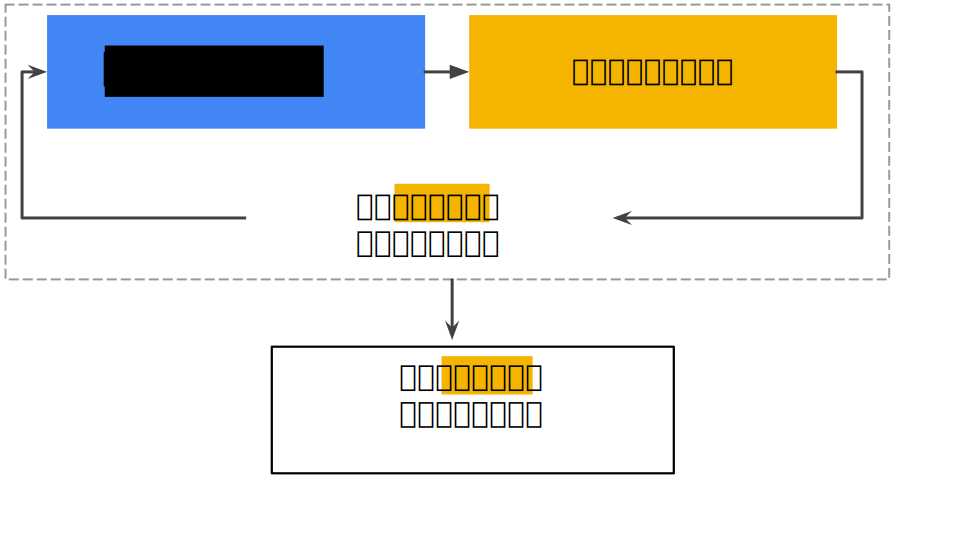
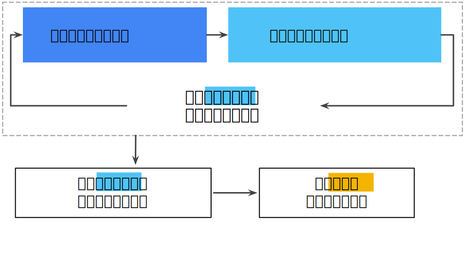

# 验证 (Validation)：另一个划分

[上一单元](https://developers.google.com/machine-learning/crash-course/training-and-test-sets/video-lecture)介绍了如何将数据集划分为训练集和测试集。借助这种划分，您可以对一个样本集进行训练，然后使用不同的样本集测试模型。采用两种分类之后，工作流程可能如下所示：

**图 1. 可能的工作流程？**

在图中，“调整模型”指的是调整您可以想到的关于模型的任何方面，从更改学习速率、添加或移除特征，到从头开始设计全新模型。该工作流程结束时，您可以选择在测试集上获得最佳效果的模型。

将数据集划分为两个子集是个不错的想法，但不是万能良方。通过将数据集划分为三个子集（如下图所示），您可以大幅降低过拟合的发生几率：

**图 2. 将单个数据集划分为三个子集。**

使用**验证集**评估训练集的效果。然后，在模型“通过”验证集之后，使用测试集再次检查评估结果。下图展示了这一新工作流程:

**图 3. 更好的工作流程。**

在这一经过改进的工作流程中：

1. 选择在验证集上获得最佳效果的模型。
2. 使用测试集再次检查该模型。

该工作流程之所以更好，原因在于它暴露给测试集的信息更少。
